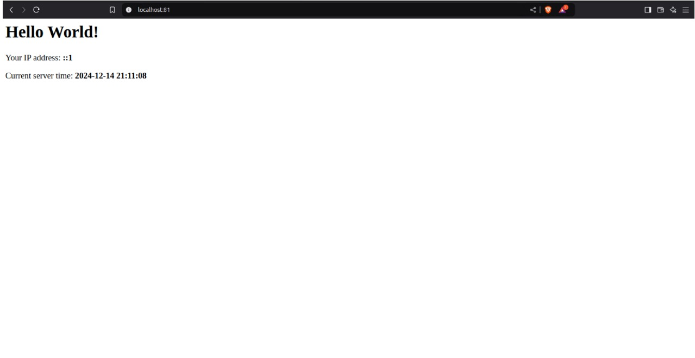
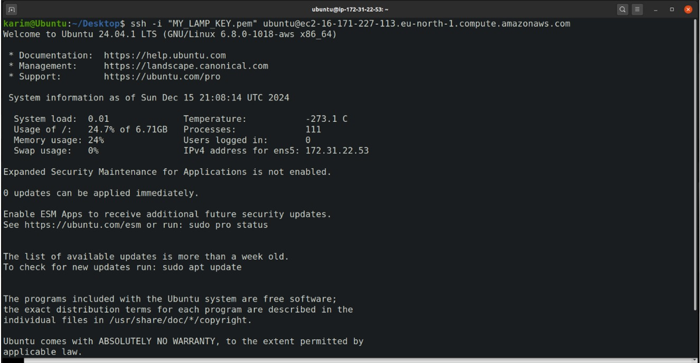

# 🌐 LAMP Stack Task

## Introduction

This guide explains the steps I followed to set up a LAMP (Linux, Apache, MySQL, PHP) stack, configure it to host a website, and make it accessible on the cloud. It also covers the networking basics involved in this setup. The steps are presented as a clear, easy-to-follow guide to help you replicate the process.

## GitHub Link
`https://github.com/KarimAql/LAMP-Stack-Task`

## Table of Contents

- [🚀 Installation](#-installation-)
  - [📦 Installing Apache, MySQL, and PHP](#📦-installing-apache-mysql-and-php)
  - [✅ Ensuring Apache is Working](#✅-ensuring-apache-is-working)
  - [🌐 Testing the Default Configuration](#🌐-testing-the-default-configuration)
  - [🔒 Securely Installing MySQL](#🔒-securely-installing-mysql)
- [⚙️ Configuration](#⚙️-configuration)
  - [🔧 Updating Apache Ports](#🔧-updating-apache-ports)
  - [📄 Creating a New Apache Configuration File](#📄-creating-a-new-apache-configuration-file)
  - [📑 Configuring VirtualHost for Port 81](#📑-configuring-virtualhost-for-port-81)
  - [🚦 Enabling the New Configuration](#🚦-enabling-the-new-configuration)
- [🌟 Creating the Website and Database](#🌟-creating-the-website-and-database)
  - [🖥️ Creating the `index.php` File](#🖥️-creating-the-indexphp-file)
  - [🌍 Testing the Configuration](#🌍-testing-the-configuration)
  - [📊 Setting Up the Database](#📊-setting-up-the-database)
  - [✏️ Modifying the `index.php` File](#✏️-modifying-the-indexphp-file)
  - [🔍 Testing Locally](#🔍-testing-locally)
  - [🗄️ Verifying the Database](#🗄️-verifying-the-database)
- [☁️ Making the Website Accessible Through the Cloud](#☁️-making-the-website-accessible-through-the-cloud)
- [🌐 Networking Basics](#🌐-networking-basics)
  - [📡 IP Address](#📡-ip-address)
  - [📜 MAC Address](#📜-mac-address)
  - [🔀 Switches, Routers, and Routing Protocols](#🔀-switches-routers-and-routing-protocols)
  - [🔓 Connecting to the Instance via SSH](#🔓-connecting-to-the-instance-via-ssh)

---

## 🚀 Installation

### 📦 Installing Apache, MySQL, and PHP
To install Apache, MySQL, and PHP, run the following commands on the Ubuntu local machine:

```bash
sudo apt-get update
sudo apt-get install apache2 mysql-server php libapache2-mod-php php-mysql
```

### ✅ Ensuring Apache is Working
To verify that Apache is active, run the command:

```bash
sudo systemctl status apache2
```

You should see an output similar to this:


### 🌐 Testing the Default Configuration
Open the browser and navigate to:

```
http://localhost:80
```

You should see the default Apache page:


### 🔒 Securely Installing MySQL
Run the following command to secure the MySQL installation and follow the prompts:

```bash
sudo mysql_secure_installation
```

## ⚙️ Configuration

### 🔧 Updating Apache Ports
Edit the `ports.conf` file located in `/etc/apache2` and add the following line to make Apache listen on port `81`:

```
Listen 81
```

### 📄 Creating a New Apache Configuration File
Create a new file in `/etc/apache2/sites-available` and name it, for example, `my-new-config.conf`.

### 📑 Configuring VirtualHost for Port 81
To configure Apache to display your website on port 81, add the following to your config file:

```apache
<VirtualHost *:81>
    DocumentRoot /path/to/your/website
    <Directory /path/to/your/website>
        AllowOverride All
        Require all granted
    </Directory>
</VirtualHost>
```

### 🚦 Enabling the New Configuration
Run the following command to enable the new configuration:

```bash
sudo a2ensite my-new-config.conf
```

## 🌟 Creating the Website and Database

### 🖥️ Creating the `index.php` File
Create an `index.php` file in the directory specified in your configuration file and add the following code:

```php
<?php
echo "Hello World";
?>
```

This should display "Hello World".

### 🌍 Testing the Configuration
Open your browser and navigate to:

```
http://localhost:81
```

You should see the following output:


### 📊 Setting Up the Database
Run the following commands to create a new database `web_db` and a new MySQL user with a password:

```bash
sudo mysql
CREATE DATABASE web_db;
USE web_db;
CREATE USER 'web_user'@'localhost' IDENTIFIED BY 'StrongPassword123';
GRANT ALL PRIVILEGES ON web_db.* TO 'web_user'@'localhost';
FLUSH PRIVILEGES;
```

### ✏️ Modifying the `index.php` File
Enhance the `index.php` file with the following functionality:

#### Database Connection
Connect to the MySQL database using PDO:

```php
<?php
$pdo = new PDO('mysql:host=localhost;dbname=web_db', 'web_user', 'StrongPassword123');
?>
```

#### Table Creation
Ensure the `visitors` table exists in the database:

```php
$pdo->exec("CREATE TABLE IF NOT EXISTS visitors (
    id INT AUTO_INCREMENT PRIMARY KEY,
    ip_address VARCHAR(45),
    visit_time TIMESTAMP DEFAULT CURRENT_TIMESTAMP
)");
```

#### Capturing Visitor Data
Retrieve the visitor's IP address:

```php
$ip_address = $_SERVER['REMOTE_ADDR'];
```

#### Logging Data
Insert the visitor's IP address and the current timestamp into the `visitors` table:

```php
$pdo->prepare("INSERT INTO visitors (ip_address) VALUES (?)")->execute([$ip_address]);
```

#### Displaying Information
Display a welcome message, the visitor's IP address, and the current server time:

```php
echo "Welcome! Your IP address is $ip_address. Current server time is " . date('Y-m-d H:i:s');
```

#### Error Handling
Handle any errors during database connection or execution:

```php
try {
    // Database logic here
} catch (PDOException $e) {
    echo "Error: " . $e->getMessage();
}
```

### 🔍 Testing Locally
Open the browser and navigate to:

```
http://localhost:81
```

You should see the following:


### 🗄️ Verifying the Database
Run the following commands to check the visitors' table:

```bash
sudo mysql
USE web_db;
SELECT * FROM visitors;
```

You should see a record of visitors:


## ☁️ Making the Website Accessible Through the Cloud

### Steps to Configure Cloud Accessibility
- Log in to the AWS Management Console.
- Launch an EC2 instance with Ubuntu, t3.micro, and 8GB storage.
- Allow SSH and HTTP connections.
- Create a key pair and save it locally.
- Launch the instance.
- Create a new security group named "LAMP Security Group," allowing inbound traffic on port 81.
- Add the security group to the instance.


- Connect via SSH:
!
```bash
ssh -i /path/to/your-key.pem ubuntu@your-instance-public-dns
```

- Repeat the installation, configuration, and database setup steps.
- Test the website by accessing `http://16.171.227.113:81/`.


- Verify the visitors in the database.

- The Website is now publicly accessible through: `http://16.171.227.113:81/`
  
## 🌐 Networking Basics

### 📡 IP Address
An 🌍 *IP address* (Internet Protocol address) is a unique identifier assigned to each device on a network. It allows devices to communicate with each other by routing data to the correct destination. There are two main types of IP addresses: 🌐 *public* (used for internet communication) and 🏠 *private* (used within local networks). Each device on a network, whether a computer, server, or router, uses an IP address to send and receive information.

In the task above, the 🌍 *IP address* plays a crucial role in making the website publicly accessible:

1. **Server Identification**: The **public IP address** of the AWS instance identifies the server, enabling external clients to communicate with it over the internet. Without this unique address, devices wouldn’t be able to find the server hosting the website.

2. **Firewall Configuration**: To allow users to access the website, **inbound rules** in the AWS security group were configured to permit traffic on port 81. This ensures that HTTP requests sent to the *public IP address* on port 81 can reach the Apache server.

3. **Website Accessibility**: When users visit `http://16.171.227.113:81/`, the **public IP address (16.171.227.113)** directs the browser’s request to the server, and Apache responds with the appropriate content, such as the index.php file configured in the server’s document root.

In summary, the 🌍 *IP address* facilitates the identification of
the server and enables proper routing of data between the server and external clients, making the website accessible.

### 📜 MAC Address
A 🖧 *MAC address* is a unique identifier assigned to a device's network interface card (NIC), used for communication within a local network. It is a 48-bit address that is permanent and embedded in the hardware.

#### Purpose:
- 🎛️ It helps devices identify each other on a local network (e.g., Ethernet or Wi-Fi).

#### Differences from an IP address:
1. **Layer**: 🛠️ MAC addresses operate at the *Data Link Layer* (local network), while 🌐 IP addresses operate at the *Network Layer* (across networks).
2. **Uniqueness**: 🔒 MAC addresses are *fixed* to the device, while 🌀 IP addresses can be *assigned dynamically* or changed.
3. **Scope**: MAC addresses work only *locally*, while 🌍 IP addresses route data across networks (including the internet).

In summary, 🖧 MAC addresses identify devices locally, while 🌍 IP addresses enable communication across networks.

### 🔀 Switches, Routers, and Routing Protocols

#### Switches:
A 🔌 *switch* is a network device that connects multiple devices within a local area network (LAN) and forwards data between them based on 🎛️ *MAC addresses*. It operates at the **Data Link Layer** of the OSI model and helps create a network by directing traffic within it efficiently.

- **Role**: Switches enable devices to communicate within a network by forwarding data to the correct device using its 🎛️ MAC address.

#### Routers:
A 🌐 *router* connects different networks, such as a local network to the internet. It forwards data packets between networks using *IP addresses* and operates at the **Network Layer** of the OSI model.

- **Role**: Routers determine the best path for data to travel from one network to another, such as from a home network to the internet.

#### Routing Protocols:
📡 *Routing protocols* are rules used by routers to determine the best path for forwarding data across networks. Examples include:
- 🔗 *OSPF (Open Shortest Path First)*
- 🔄 *RIP (Routing Information Protocol)*
- 🛤️ *BGP (Border Gateway Protocol)*

- **Role**: Routing protocols help routers communicate and share information about network topology, enabling them to make intelligent routing decisions.

### Summary:
- 🔌 *Switches* connect devices within a LAN and use 🎛️ MAC addresses to forward data.
- 🌐 *Routers* connect different networks and use *IP addresses* to route data between them.
- 📡 *Routing protocols* enable routers to exchange information and determine the best paths for data.

### 🔓 Connecting to the Instance via SSH
To connect to the cloud instance, use Secure Shell (SSH), which provides encrypted communication between your local machine and the remote server. Here’s how:

1. **Generate a Key Pair**: When setting up the EC2 instance, generate a 🗝️ private and public key pair. Save the `.pem` file securely on your local machine.
2. **Grant Access**: Use the `chmod` command to ensure your private key file is readable only by you:

   ```bash
   chmod 400 /path/to/your-key.pem
   ```

3. **Connect to the Server**: Run the following SSH command, replacing `/path/to/your-key.pem` with the path to your private key file and `your-instance-public-dns` with the public DNS name of your instance:

   ```bash
   ssh -i /path/to/your-key.pem ubuntu@your-instance-public-dns
   ```

4. **Success**: Upon successful connection, you'll see a terminal prompt for the remote server, allowing you to run commands directly on the instance.

   - Use this secure connection to configure the server, upload files, or monitor performance.


In summary, SSH 🔓 ensures a secure and encrypted connection between your local machine and the cloud instance, enabling you to manage the server effectively.
